# Wielobranżowy sklep internetowy

## Wprowadzanie danych

Sklep od początku zawiera rozbudowany asortyment: kilkudziesięciu pracowników, kilka kategorii produktów, departamentów, wielu klientów, różne rabaty oraz sposoby dostawy i płatności. Wszystkie dane są wprowadzane przez administratora sklepu w specjalnej konsoli. Aby zalogować się jako administrator należy wpisać login: `admin` oraz puste hasło. W konsoli administratora można dodawać, usuwać i modyfikować wszystkie dane. Ma on również możliwość wyświetlenia wszystkich danych w bazie, w przeciwności do użytkownika, który może tylko przeglądać ofertę sklepu, dodawać produkty do koszyka, składać zamówienia oraz sprawdzać status zamówień oglądając tylko część informacji o swoich zamówionych produktach. Struktura bazy danych została przedstawiona na diagramie ERD załączonym do projektu. Dokładny proces tworzenia tabeli oraz wstępne uzupełnienie ich o dane można zobaczyć w plikach `erd_diagram_project.sql` oraz `erd_fill_tables.sql`.

## Dokumentacja użytkownika

### Instalacja

Aby aplikacja działała poprawnie, należy zainstalować bazę danych PostgreSQL oraz zainstalować odpowiednie biblioteki do połączenia z bazą danych. W pliku `requirements.txt` znajdują się wszystkie potrzebne biblioteki. Aby je zainstalować należy wpisać w konsoli: `pip install -r requirements.txt`. Po uruchomieniu aplikacji `gui.py`, sama połączy się z bazą danych.

### Interfejs użytkownika

Aplikacja posiada prosty interfejs graficzny. Po uruchomieniu aplikacji, użytkownikowi wyświetla się okno logowania przez podanie swojego imienia i nazwiska. Istnieje również możliwość utworzenia nowego konta. Po zalogowaniu się, użytkownikowi wyświetla się główne okno aplikacji, w którym może złożyć nowe zamówienie, sprawdzić status swoich zamówień oraz wylogować się. W zakładce `Złóż nowe zamówienie` użytkownik może złożyć nowe zamówienie, wybierając produkty z listy, sposób dostawy, rabat i płatności. W zakładce `Sprawdź swoje zamówienia` użytkownik może sprawdzić status swoich zamówień. Status zamówienia jest zmieniany każdego następnego dnia po jego złożeniu na `Złożono`, `Wysłano` i `Dostarczono`. W zakładce `Wyloguj się` użytkownik może wylogować się z aplikacji.
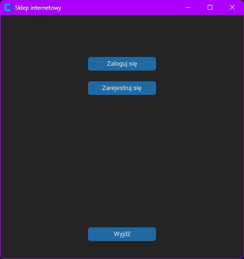
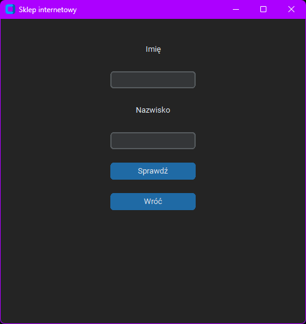
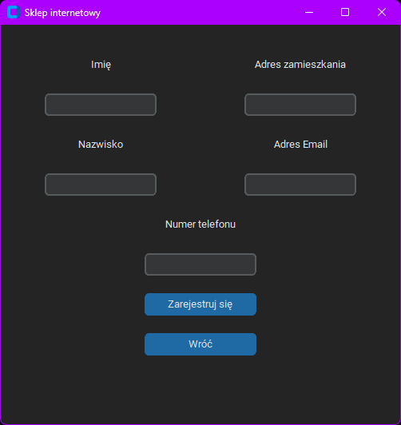
### Instrukcja użytkowania
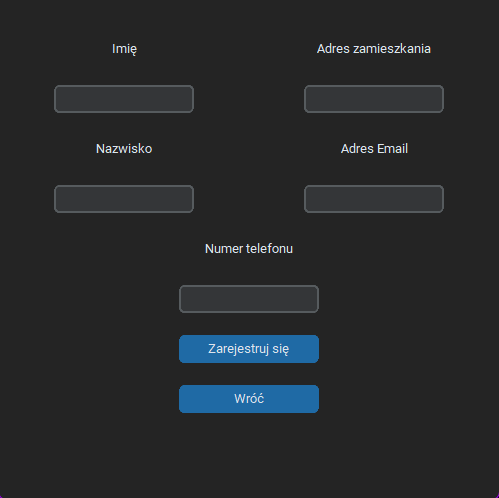
Aby złożyć nowe zamówienie, należy wybrać ilość różnych produktów do zamówienia, sposób dostawy, rabat i płatności. Następnie należy kliknąć przycisk `Dalej`. Po kliknięciu przycisku `Dalej` wyświetli się okno z wyborem produktu i jego ilości. Po wybraniu produktu i jego ilości należy kliknąć przycisk `Dodaj`. Nowe okno wyświetli się tyle razy ile różnych produktów chcemy zamówić. Po zakończeniu procesu wystarczy kliknąć przycisk `Wróć` aby wrócić do głównego okna aplikacji. Aby sprawdzić status swoich zamówień, należy kliknąć przycisk `Sprawdź swoje zamówienia`. Wyświetli się okno z listą zamówień. Aby wylogować się z aplikacji, należy kliknąć przycisk `Wyloguj się`.
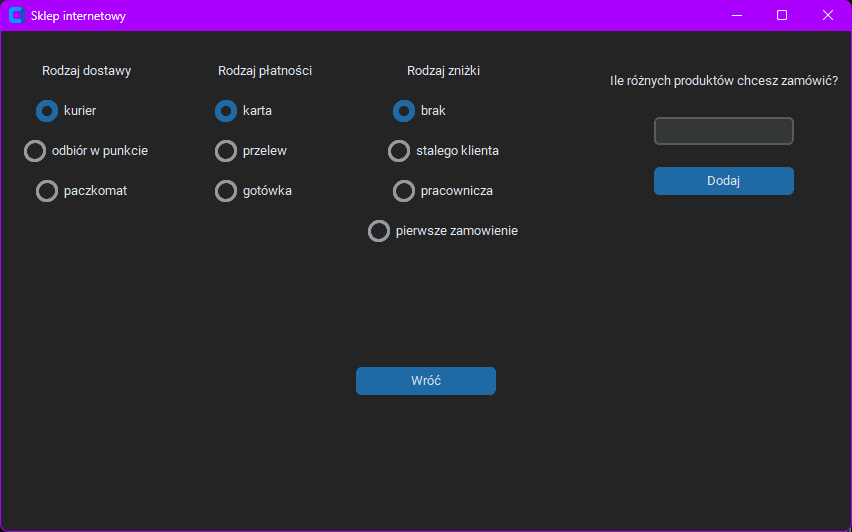
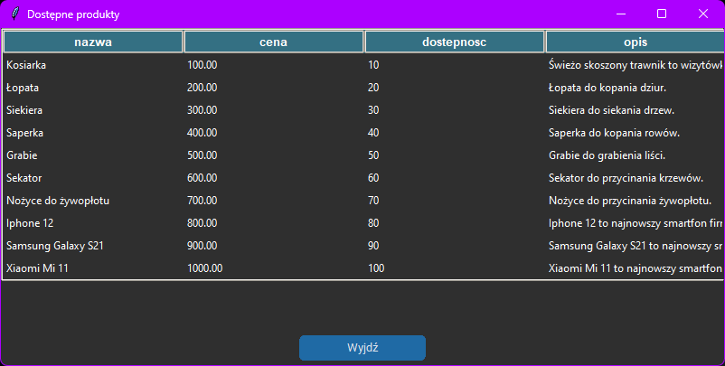
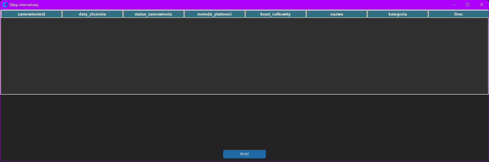
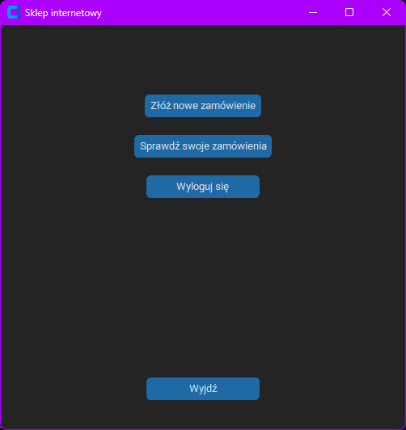
## Dokumentacja techniczna

### Struktura projektu

Aplikacja składa się z dwóch głównych części: interfejsu graficznego oraz bazy danych. Interfejs graficzny został stworzony w języku Python przy użyciu biblioteki `tkinter`. Baza danych została stworzona w PostgreSQL. Połączenie z bazą danych zostało zrealizowane przy użyciu biblioteki `psycopg2`. Wszystkie dane są przechowywane w bazie danych. Aplikacja jest podzielona na dwie części: administratora i użytkownika. Administrator ma dostęp do wszystkich danych w bazie, natomiast użytkownik może tylko przeglądać ofertę sklepu, dodawać produkty do zamówień, składać zamówienia oraz sprawdzać status zamówień oglądając tylko część informacji o swoich zamówionych produktach.

### Opisy stałych

W aplikacji znajdują się dwie stałe: `User` oraz `Admin`. Stała `User` odpowiada za użytkownika, który może przeglądać ofertę sklepu, dodawać produkty do koszyka, składać zamówienia oraz sprawdzać status zamówień oglądając tylko część informacji o swoich zamówionych produktach. Stała `Admin` odpowiada za administratora, który może dodawać, usuwać i modyfikować wszystkie dane w bazie. Ma on również możliwość wyświetlenia wszystkich danych w bazie, w przeciwności do użytkownika.
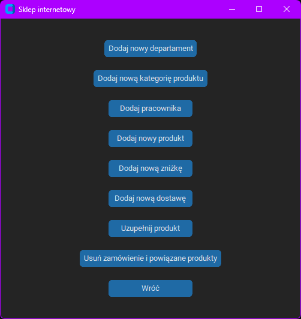
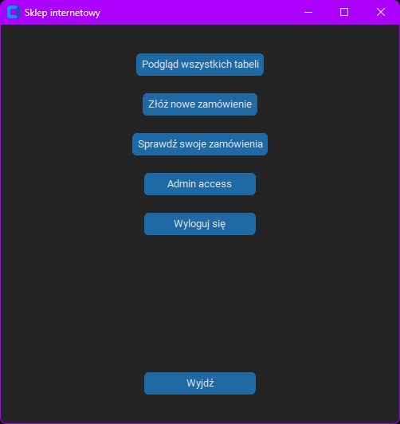
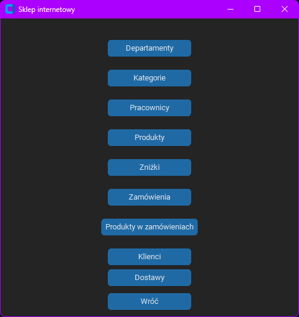
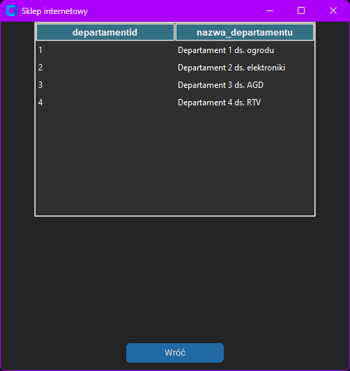
### Opisy funkcji bazodanowych

Podczas składania zamówień jak i ich usuwania wywoływane są wyzwalacze które pozwalają na automatyczną zmianę tablic powiązanych z zamówieniem. Gdy usuwamy zamówienie o id równym 1, usunięte zostaną również wszystkie rekordy zamowienieprodukt powiązane z tym zamówieniem. Gdy składamy zamówienie, wywoływany jest wyzwalacz, który zmienia status zamówienia na `Złożono`. Następnie, po upływie jednego dnia, wywoływany jest wyzwalacz, który zmienia status zamówienia na `Wysłano`. Po upływie dwóch dni, wywoływany jest wyzwalacz, który zmienia status zamówienia na `Dostarczono`. Dla użytkownika z określonym id automatycznie tworzony jest widok, który zawiera informacje o jego zamówieniach. W widoku tym znajdują się informacje o zamówieniu, produkcie, cenie, ilości, sposobie dostawy, rabacie i płatności. 

### Opisy funkcji programu

W aplikacji znajdują się dwie funkcje: `login` oraz `register`. Funkcja `login` odpowiada za logowanie użytkownika do aplikacji. Funkcja `register` odpowiada za rejestrację użytkownika w aplikacji. Przeglądanie tabeli przez admina jest realizowane przez funkcję `show_all_records`. Dodawanie rekordów do tabeli przez admina jest realizowane przez odpowiadające tabelom funkcje, posiadające mechanizmy uniemożliwiające niepoprawne wstawianie danych bądź ich duplikację. Usuwanie danych z tabeli zamówień jest realizowane przez funkcję `delete_order_and_connected_products`. Usuwa ona zamowienie przez jego numer id. Funkcja `add_order_to_db` realizuje dodawanie zamowienia do bazy danych, również sprawdzając poprawność wprowadzanych danych. Reszta funkcji odpowiada za wyświetlanie określonych okien aplikacji oraz obsługę przycisków wywołujących odpowiednie funkcje.

## Żródła

- https://www.postgresql.org/docs/9.1/sql-createtrigger.html
- https://www.postgresql.org/docs/9.1/sql-createview.html
- https://docs.python.org/3/library/tkinter.html
- https://github.com/TomSchimansky/CustomTkinter